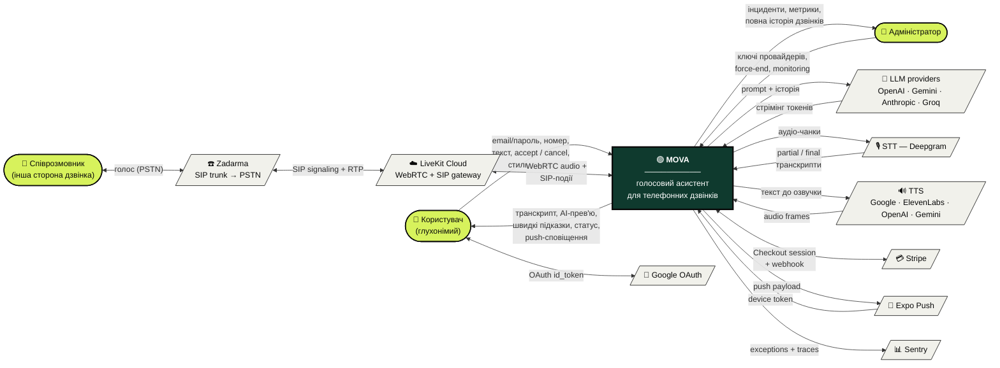

# Діаграма 1 — Контекстна (DFD Level 0)

Система MOVA як «чорний ящик» і всі зовнішні сутності, з якими вона
обмінюється даними. Внутрішні сервіси (api-gateway, agent-worker,
realtime-service, Postgres, Redis) сховано всередині системи —
з'являються тільки на Level 1.

## Нотація

| Фігура | Що означає |
|---|---|
| Овал (лайм) | Людина-актор |
| Прямокутник (форест) | Сама система MOVA |
| Паралелограм (бежевий) | Зовнішня служба / провайдер |
| Стрілка з підписом | Потік даних (текст / голос / події) |

Двонапрямлені стрілки використано **тільки** там, де обмін справді
синхронний (запит-відповідь або діалог); решта — одностороннє.

## Діаграма

## Опис потоків

### Людські актори

**Користувач (глухонімий)** — основний beneficiary. Не чує/не говорить
голосом, тому з застосунком взаємодіє ТЕКСТОМ + ВІЗУАЛЬНО:
- надає: облікові дані, номер для дзвінка, друкований текст, тапи на
  швидкі підказки, accept/cancel прев'ю AI, налаштування стилю/голосу;
- отримує: live-транскрипт співрозмовника, картку «що зараз скажу»,
  3 варіанти швидких відповідей, статус дзвінка, push-сповіщення.

**Співрозмовник** — людина на іншому кінці звичайного телефонного дзвінка.
**Не знає** що говорить з ШІ — для нього це звичайна голосова розмова.

**Адміністратор** — оператор у admin-SPA. Дає системні ключі провайдерів
(шифровані AES-256-GCM), бачить інциденти, може примусово завершити дзвінок.

### Зовнішні служби

**LiveKit Cloud** — голосова інфраструктура. Зводить SIP-leg
співрозмовника + WebRTC-leg агента в одну кімнату. MOVA отримує SIP-події
(connected / answered / ended).

**Zadarma** — SIP trunk на справжню телефонну мережу. Через нього
ходять реальні дзвінки на справжні номери.

**LLM-провайдери** — генерація відповідей. Чотири з health-ranked
fallback'ом: OpenAI → Gemini → Anthropic → Groq (для швидких підказок).

**STT (Deepgram)** — потокове транскрибування мови співрозмовника.
Whisper як fallback.

**TTS** — синтез голосу. Google Cloud за замовчуванням (`uk-UA-Wavenet`,
найдешевший і стабільний для UA), ElevenLabs для преміум-голосів.

**Stripe** — оплата підписок і top-up балансу. Webhook'и підтверджують
платежі.

**Google OAuth** — Sign-In through Google як альтернатива email/паролю.

**Expo Push** — сповіщення на мобільний пристрій (втрата з'єднання,
завершення дзвінка, нові швидкі чаплети).

**Sentry** — спостережність. Усі unhandled exceptions + WS parse
errors + HTTP 5xx → події в Sentry.

## Що НЕ показано (свідомо)

- **Postgres** — внутрішній persistence шар MOVA, з'явиться на Level 1
- **Redis** — pub/sub між api-gateway / agent-worker / realtime-service,
  внутрішній
- **Prometheus / Grafana / Loki** — внутрішня observability-стек
- **Декомпозиція MOVA на сервіси** — це Level 1+

## Як рендерити

- GitHub: відображається автоматично у markdown-preview.
- VS Code: розширення «Markdown Preview Mermaid Support».
- Експорт у PNG/SVG: <https://mermaid.live/> → вставити блок коду →
  Actions → PNG/SVG.

Для друку у диплом — згенеруй SVG через mermaid.live і встав як зображення.
